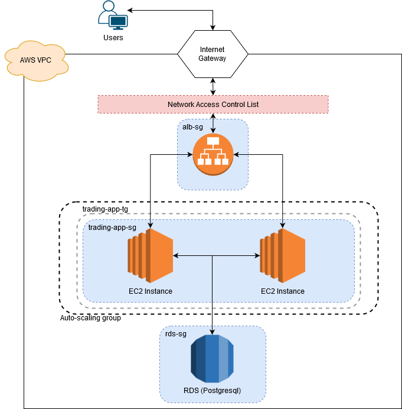
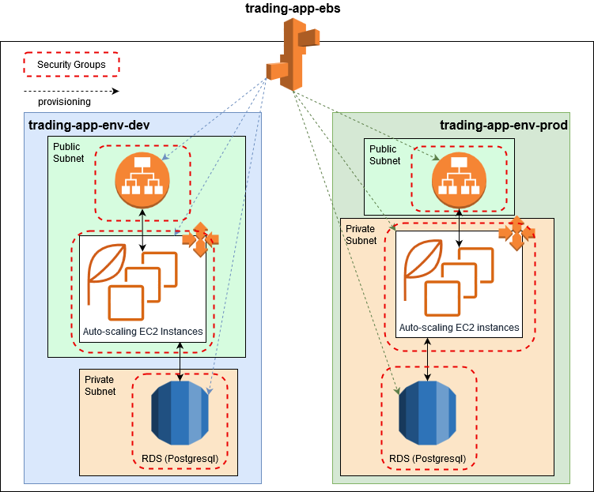
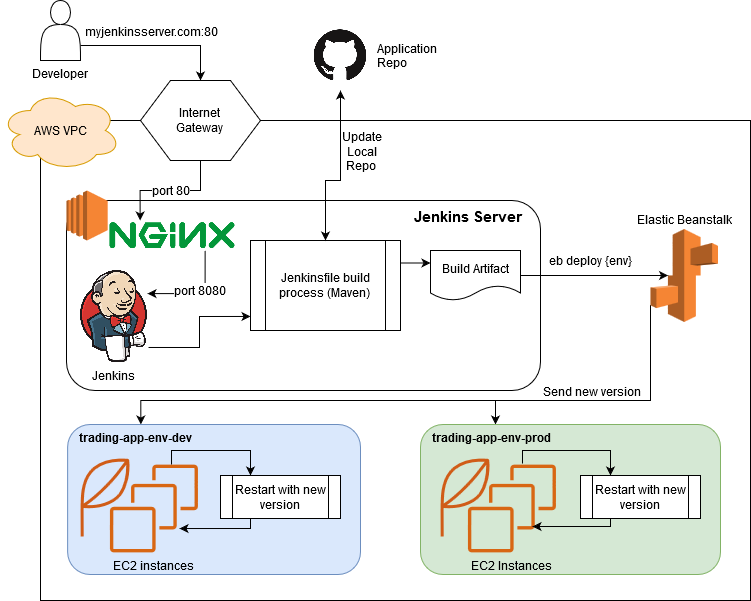

# Cloud & Devops

## Table of Contents

* [Introduction](#introduction)
* [Cloud Application Architecture](#cloud-application-architecture)
  * [Scaling](#scaling)
* [Deployment Environments](#deployment-environments)
* [Jenkins Server](#jenkins-server)
  * [Jenkins CI/CD Pipeline](#jenkins-cicd-pipeline)
* [Project Improvements](#project-improvements)

## Introduction

This project involves converting a previous project into a cloud-ready application, complete with
build and deployment automation using Jenkins. This project also explored the cloud application hosting
services provided by Amazon AWS.

The project that was used to explore AWS' tools was the Stock Market trading simulation made with springboot.
That project is a three tier, microservice-based REST API which allows users to simulate day trading
using real market data provided by a third party, IEX Trading.

The AWS tools explored in this project were:
- Virtual Private Cloud (Security Groups, Network Access Control Lists, Route Tables)
- Elastic Cloud Compute (instances, auto-scaling, Application Load Balancers, Amazon Machine Images)
- Relational Database System (Databases and backups)
- Elastic Beanstalk (Applications and Environments)
- Cloudwatch (Monitoring & integration with auto-scaling)
- Simple Notification System (with billing alerts, integration with auto-scaling)

This project also served as an introduction to CI/CD pipelines using a Jenkins server, supported by
NGINX reverse proxy, to automatically build and deploy the Springboot project onto Elastic Beanstalk.

## Cloud Application Architecture

The following diagram illustrates the overall architecture used to set up the application.

### Scaling

The Auto-scaling group uses Cloudwatch to monitor various statistics to determine if new instances 
need to be created, or if running instances need to be decommissioned. The conditions that trigger
auto-scaling are user-defined rules based on the metrics gathered by Cloudwatch. 

For the sake of this project, we used an easily controllable metric: total number of incoming requests
over time. If we have over 100 requests per minute for 5 minutes then make a new instance; less than
50 a minute for 5 minutes then remove an instance. Naturally, other metrics such as average CPU usage
will be more useful in most cases.

## Deployment Environments

In AWS, Environments are a concept used in Elastic Beanstalk to form a separation in application
deployments. Most commonly, there is a Development environment and a Production environment, each
with their own set of EC2 instances, RDS instances, and network infrastructure. The following diagram
shows an example of two application environments.

The development environment is typically used for application testing and troubleshooting. The development
environment may often have more tools on their instances and allow developers to SSH into them to
perform troubleshooting or other diagnostics.

The production environment contains the "live" code that is in use by the customers. This environment
will have more strict security rules in place to protect the backend systems from intrusions or attacks.

## Jenkins Server

Jenkins is a build automation tool which can be extended to support source control integration and
build deployment pipelines. Builds may be scheduled to run regularly, or when specific branches of a
repository are updated. Jenkins pipelines are defined by a Jenkinsfile, which describes the steps needed
to build an artifact and deploy it to your system. The following diagram shows how Jenkins was provisioned
relative to Beanstalk, and how Jenkins deploys a new build.

### Jenkins CI/CD Pipeline

The CI/CD pipeline consists of two parts: the Jenkins project in the web UI, and the Jenkinsfile.

The Jenkins project manages retrieving and updating the project source code, and triggering the pipeline.
When a build runs, the project updates the source code, then executes the Jenkinsfile on an available 
agent. 

The Jenkinsfile consists of a pipeline, an agent selection, and a stages section consisting of
one or more named stages. Each stage runs in sequence, and consists of one or more steps to achieve
some goal in the build/deploy process, such as running a build script (Maven, Gradle, etc.). Stages 
may optionally have run conditions. The above diagram shows a sample workflow in the context of an
AWS Elastic Beanstalk build deployment.

## Project Improvements
- Decouple the production database from the Beanstalk application to prevent losing it if the environment
is destroyed.
- Tighten Network Access Control List and Security Group rules.
- Make more useful Auto-scaling conditions for the application.
- Improve subnet and route table management.
- Project was slightly restricted by AWS Free tier constraints.