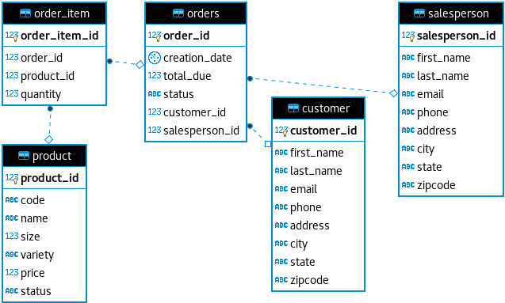

# JDBC

## Introduction
This app serves as a sample of the JDBC workflow. 
Connecting to a database, executing some statements, processing the results, and closing the connection. 
Coding with JDBC will be invaluable as a data engineer as almost all structured data you will be processing is going to be stored in a RDBMS.

## Entity Relationship Diagram

## Design Patterns

### Data Access Object (DAO)
The DAO design pattern involves the use of more complex queries to collect and transform data in remote data sources.
DAOs will typically work with multiple related DTOs and defer joins and other functions to the Database.
Because of this deferral, a DAO will typically need fewer statements and connections to do its job. 
DAOs don't work as well in distributed DBs as inter-DB joins are usually not feasible or even possible.

### Repository
The Repository pattern involves using simple queries to collect and transform data in remote data sources.
Repositories will typically work with only a single DTO, often querying a single table at a time.
Repositories will typically perform any Joins or other data transformations for themselves, rather than requesting them from the DB.
Due to these two properties of Repositories, they are better suited to distributed systems in which DAOs struggle.