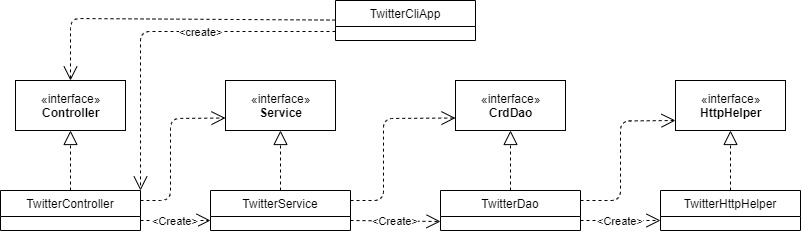

# Twitter CLI App
## Introduction
The Twitter CLI App provides a basic interface with which a user can interact with Twitter. 
The application provides 3 functions, post a tweet with or without Geolocation, view a Tweet 
(with only certain fields if desired), and delete one or more tweets.

This project introduced the full MVC architecture, Apache HTTP Components Package, Spring and SpringBoot, 
Mockito, and JUnit.

## Design
### Class Diagram

### Class Breakdown
TwitterCliApp
- The main class. Collects the CLI arguments, then calls the appropriate command in the controller.
Results received here are pretty-printed to the command line.

TwitterController
- Organizes the CLI arguments based on the command, then invokes the Service component to process
our request and retrieve the results from Twitter. TwitterController is concerned primarily with
the number of arguments that have come from the CLI.

TwitterService
- Verifies that the CLI arguments are sensible and performs any post-processing
on the Tweets returned, as needed. TwitterService mainly deals with ensuring the CLI arguments
are correct.

TwitterDao
- Builds HTTPS requests to interact with the Twitter API, and parses the incoming
JSON responses from Twitter. Throws exceptions if the connection fails, or Twitter replies with 
something other than a Tweet.

TwitterHttpHelper
- Executes requests on behalf of the user. Deals with OAuth signing, sending requests, and 
recieving replies from Twitter.

## Quick Start
### Packaging
The application may be packaged by invoking `mvn package` in the project's root directory.

### Usage
The application has 3 different use cases.
- `TwitterCli post "Tweet text" [longitude latitude]`
    - Posts a Tweet with the given text. Geolocation coordinates may optionally be given.
    Note that location must be enabled on your account to use geolocation.
    
- `TwitterCli show TWEET_ID [Field...]`
    - Prints a tweet with the given Tweet ID. Field names may be given to nullify all other fields 
    in the Tweet. Note that you must have permission to view the tweets whose IDs are provided.
    
- `TwitterCli delete TWEET_ID...`
    - Deletes one or more tweets, based on the IDs provided. The deleted tweets are printed to the 
    command line. Note that you must have permission to delete the tweets whose IDs are given.
    
## Model
This app uses a simplified version of the Tweet Model. The full version may be found 
[here](https://developer.twitter.com/en/docs/tweets/data-dictionary/overview/tweet-object).

The Tweet model used by this app is as follows:

Tweet

| Field Name | Type |
|------------|------|
|created_at|String|
|id|long|
|id_str|String|
|text|String|
|entities|TweetEntities|
|location|GeoLoc|
|retweet_count|int|
|favorite_count|int|
|retweeted|boolean|
|favorited|boolean|

GeoLoc

| Field Name | Type |
|------------|------|
|type|String|
|coordinates|float[]|

TweetEntities

| Field Name | Type |
|------------|------|
|hashtags|Hashtag[]|
|user_mentions|Mention[]|

Hashtag

| Field Name | Type |
|------------|------|
|indices|int[]|
|text|String|

Mention

| Field Name | Type |
|------------|------|
|id|int|
|id_str|String|
|indices|int[]|
|name|String|
|screen-name|String|

## Potential Improvements
- Add Retweeting, favoriting.
- Add considerations for link wrapping when counting characters.
- Add a record of posted Tweets for easier lookup after creation.
- Add posting Tweets with media.
- Add timeline viewing.
