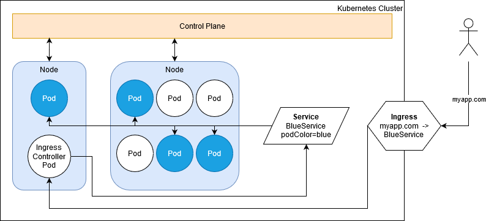
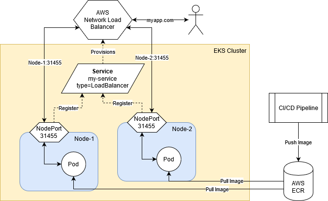
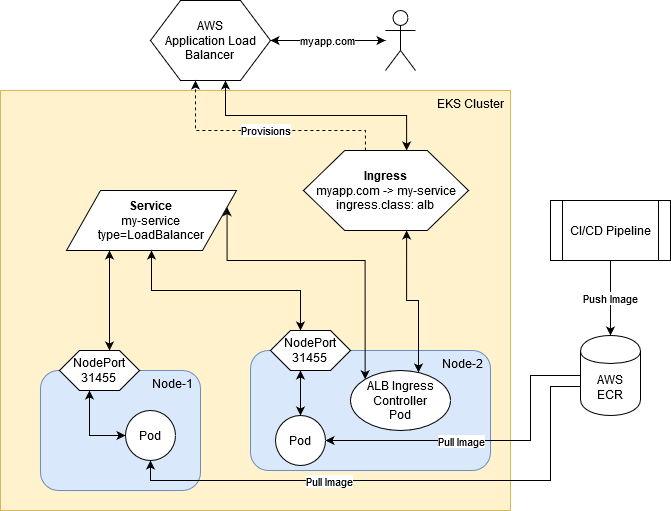

# Deploying Applications on Kubernetes Clusters

Table of Contents
* [Introduction](#introduction)
* [Kubernetes Architecture](#kubernetes-architecture)
* [Amazon EKS](#amazon-eks)
  * [Preparing the EKS Cluster](#preparing-the-eks-cluster)
  * [Deploying to EKS](#deploying-to-eks)
* [Improvements](#improvements)

## Introduction

This project served as an introduction to cluster-based application deployment using Kubernetes.
Over the course of this project I learned about the Kubernetes architecture, Role-based Access Control,
and Amazon IAM and EKS.

## Kubernetes Architecture

A Kubernetes cluster consists of a Control Plane, which hosts a web API for the cluster to perform 
administrative tasks with, and one or more Nodes, which host the applications being run inside the 
cluster. Each node runs a number of pods, which are groups of one or more application containers.

Pods are grouped together and accessed at a single point called a Service. Services select pods based
on the labels assigned to them, and are typically used to expose those pods to the outside world. 
Some specialized service types may also provide functionality like provisioning load balancers, or
creating CNAME records that point to external resources. 

Ingresses are a means for users outside the cluster to access applications within it without needing
to know details about which node, pod, or NodePort they need to access. Users simply need the DNS name,
and they can access the associated app. Ingresses typically only work if an Ingress Controller has been
installed on the cluster. The NGINX reverse proxy controller is commonly used for this in on-site solutions,
but most cloud providers supply their own.

The most common application deployments consist of a Deployment, which specifies what containers to run
in a pod and how many replicas of that pod to run, a Service, and an Ingress.

## Amazon EKS

Amazon Web Services' Elastic Kubernetes Service allows customers to run their kubernetes cluster in
the cloud, using Amazon's cloud platform. Using EKS allows Amazon to manage provisioning your cluster
nodes for you, and enables your cluster to access other AWS services, such as the AWS Container Registry.

Using EKS, along with some specific annotations in your service or ingress definitions, also allows 
your cluster to automatically provision and manage load balancers. EKS also allows your cluster to
integrate with Amazon's IAM controls, adding a second layer of security onto Kubernetes RBAC.

When using EKS, Amazon also assigns IP addresses to your pods from the subnet their Node belongs to,
allowing the pods to be accessible directly. This feature, however, imposes strict limits on the number
of pods you may run on each Node, based on the Node's instance type. Each instance type may only have 
a specific number of Elastic Network Interfaces(ENIs) attached, and may only assign so many private 
secondary IP addresses to each ENI. Each node will always have 3 pods active by default: `aws-node`,
 `kube-dns`, and `kube-proxy`. You cannot run more pods than the Node's IP address limit.

### Preparing the EKS Cluster

**Please note that there is no free-tier availability for Amazon EKS. You must pay the service fee for
the control plane and any instances you use.**

In order to deploy an app to EKS, you must first create a Control Plane and join at least one Node to it.
Amazon provides multiple methods to accomplish these tasks, so pick the one you are most comfortable with.
In addition to creating the cluster, you will need to tag the subnets that you want the cluster to use.
Tag all of the subnets you want to use with your cluster with `kubernetes.io/cluster/<your-cluster-name>: shared`.

**If you're using a Kubernetes version earlier than 1.15, tag your VPC with that as well**

Additionally, tag your public cluster-enabled subnets with `kubernetes.io/role/elb: 1` to enable public-facing
load balancers on those subnets, and tag your private cluster-enabled subnets with `kubernetes.io/role/internal-elb: 1`
to enable internal load-balancers on those subnets.

Refer to the [official EKS documentation](https://docs.aws.amazon.com/eks/latest/userguide/what-is-eks.html)
for detailed instructions on the various ways to create and manage your EKS cluster.

### Deploying to EKS

There is one major choice to make that can change the way you build up your EKS deployment, which type
of load balancer do you want to use? Classic and Network load balancers use a different method than
Application load balancers. 

If you want to use a Classic or Network load balancer, you can skip creating an Ingress, the load 
balancer itself acts as one. In this setup the load balancer forwards traffic to the node ports bound
by your service. To use a Classic load balancer, create a service of type `LoadBalancer`. To use a 
Network load balancer, create a service of type `LoadBalancer` and annotate it with 
`service.beta.kubernetes.io/aws-load-balancer-type: nlb`. The following diagram is an example of what
a NLB style EKS deployment looks like:

To use an Application load balancer, you must deploy the AWS ALB Ingress Controller to your cluster,
then create a service which exposes a `NodePort`, and an Ingress annotated with `kubernetes.io/ingress.class: alb`.
ALBs created by Ingress objects have two modes, which determine how the ALB forwards traffic. 

The first and default mode is instance mode, where traffic is forwarded to NodePorts. No annotation 
is needed to enable this, but you may explicitly do so with `alb.ingress.kubernetes.io/target-type: instance`. 
The second mode is IP mode, where traffic is forwarded directly to the pods. To enable this mode, 
annotate your Ingress with `alb.ingress.kubernetes.io/target-type: ip`.

To allow the Ingress Controller to provision an ALB, numerous extra steps must be taken. 
- In AWS IAM
   - An IAM OIDC provider must be created
   - A new Web Identity Provider role with a unique policy must be made
   - The role's trust relationship must specify your Ingress Controller's service account as the Audience
- In the Kubernetes Cluster
   - Create a new service account for the Ingress Controller
   - Annotate the service account with `eks.amazonaws.com/role-arn: <your-role-arn>`
   - Deploy the ALB Ingress Controller edit the deployment to specify your cluster name, VPC ID, and region
   - Edit the deployment to specify your cluster name, VPC ID, and region
   - If needed, delete any old ReplicaSets that survived the deployment being edited

The following diagram presents a simplified example of an ALB style EKS deployment:

Once the files and (if desired) the ALB Ingress Controller are prepared, they can be deployed to the
cluster through `kubectl apply`. You may refer to my build and deploy scripts in the 
[Springboot project's k8s scripts folder](../springboot/scripts/k8s).

## Improvements

For this project, I used `t3.micro` instances for my nodes to minimize costs in case of potential 
free-tier. These nodes could only support 4 pods each (including the 3 system pods in every node),
 and seemed to have significant trouble with DNS resolution.

- Use larger instances as cluster nodes
- Deploy more than one replica of the Springboot app (`t3.micro` instances could only host 1 user pod each, I did not want to create 3 nodes)
- Improve the CI/CD pipeline to use plugins for Docker and Kubernetes