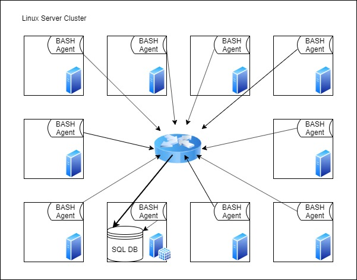

# Jarvis Linux & SQL Project: BASH monitoring Agent

## Introduction

This Project Contains a Linux Server Cluster Monitoring Tool. This tool requires the provided monitoring agent be installed on each server.

This tool is made to help the Infrastructure Team make decisions regarding server provisioning.

## Architecture & Design

Database Tables:
 - `host_info` contains the hardware information of each cluster node.
 - `host_usage` contains information on the usage staticstics on each cluster node.

Monitoring Agent Scripts:
 - `host_info.sh` should be run only once. It adds a record of the host's hardware specifications to the database.
 - `host_usage.sh` should be set to run via crontab. It records the host's resource utilization in the database.

## Usage
1. Install PostgreSQL and create the database PUBLIC.
2. `cd` to the sql directory, then run the command `psql -h localhost -f ddl.sql PUBLIC`.
3. `cd` to the scripts directory and run `./host_info.sh`
4. Run `crontab -e` and add the line `* * * * * ~/dev/jarvis_data_eng_mathew/linux_sql/scripts/host_usage.sh` to the end of the file. `host_usage.sh` need not be used manually.

## Improvements
 - Detect and handle hardware changes.
 - Create a daily/weekly/etc. usage report file
 - Enhance scripts to allow them to connect to remote SQL server instead of localhost
