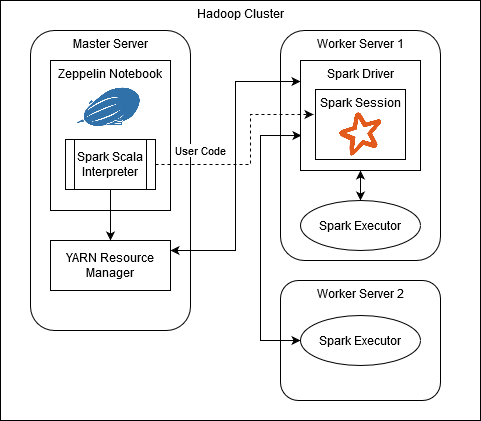
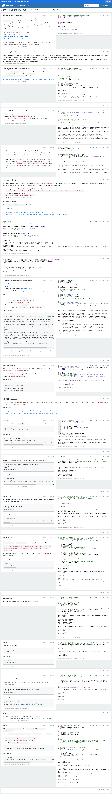
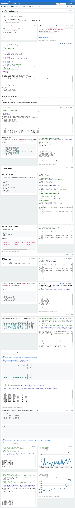

# Spark Introduction Project
#### Table of Contents
* [Introduction](#introduction)
* [Spark Architecture](#spark-architecture)

## Introduction
This project acts as an introduction to Big Data processing using Apache Spark and Scala.
The project involved solving a series of problems related to sales data using Resilient Distributed 
Datasets (RDDs), Spark's Structured APIs (DataFrames and Datasets), and SparkSQL.

## Spark Architecture
The hardware architecture behind this project is much the same as the previous Hadoop project, as it was completed
on the same cluster. Zeppelin features a pre-configured Spark interpreter for Scala. Zeppelin sends 
code to be executed through Spark to YARN, which launches the Spark Driver on one of the worker nodes.
The Spark driver then converts the user code into a logical and physical execution plan, then works 
with YARN to launch Spark executors that perform the actual work.

## Spark RDD Project
RDDs offer lower-level control over data, requiring a bit more work to manage typing and data parsing.
The functions provided by RDDs offer a more "Pure Scala" approach to data manipulation, with several
functions being common in Scala, such as `Zip`, `Map`, `Filter`, and `Reduce`.

This project involved performing some data processing on sample retail data, including solving CSV 
parsing issues. The project also involved solving some simple business questions related to the data.

## Spark DataFrame Project
The structured APIs consist primarily of generic DataFrames and typed DataSets. These two types provide
an SQL-like form of interacting with data, where the data is organized into tables. The functions available
with the Structured API mirror several available with RDDs, but taking a more SQL-like approach by introducing
named Columns, and the ability to evaluate fragments of SQL expressions. In addition the SparkSession
allows the use of SparkSQL as-is.

Spark's Structured APIs are preferred over RDDs as they are better optimized by Catalyst (Spark's internal
code format), are less likely to encounter parsing issues, and are generally easier to work with due to 
the existence of columns and the ability to execute fragments of SQL code directly.

This project involved solving more complex business questions than the previous project, mirroring
SQL queries which would solve the problem. This project also utilized Zeppelin's graphing features
to plot the results of certain queries.

