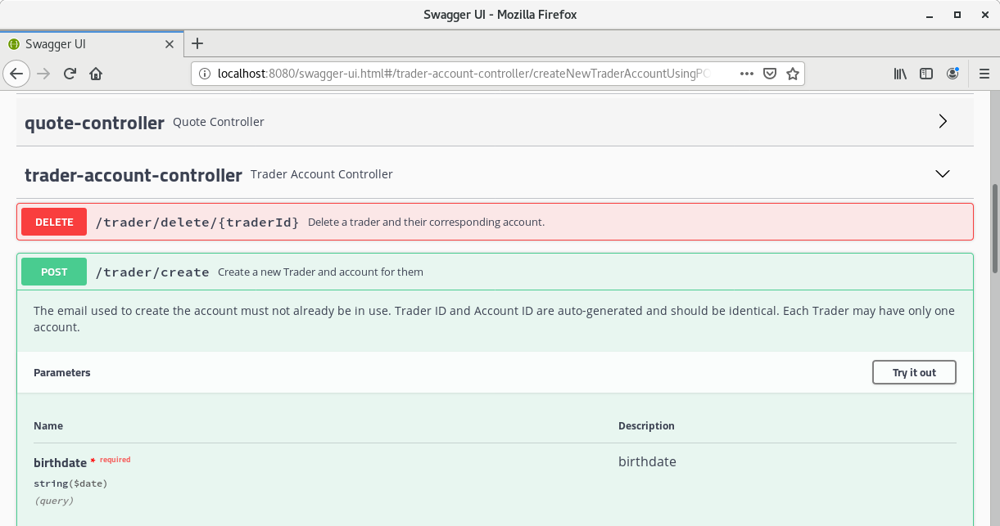
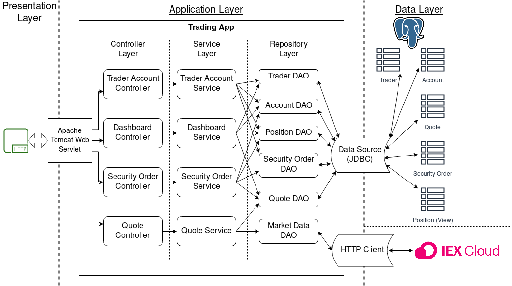
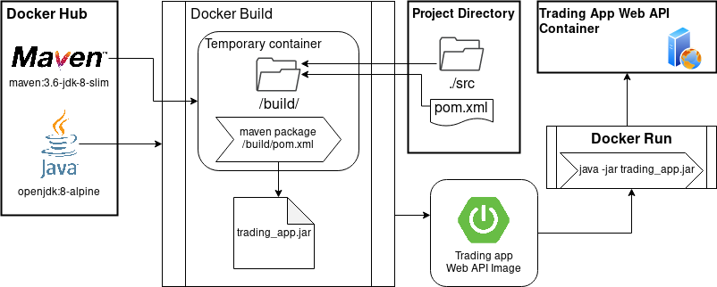
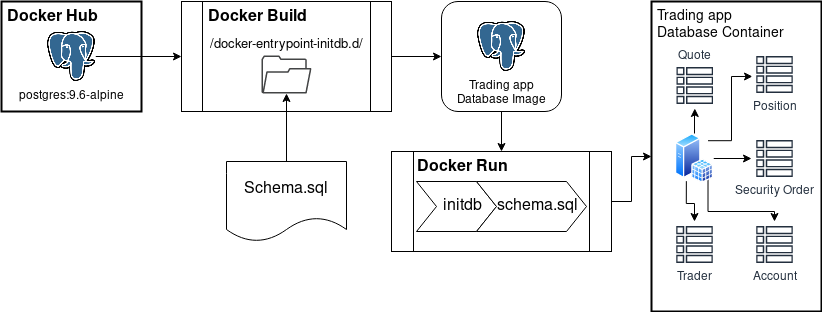

# Springboot Stock Trading Web Api

Table of Contents
* [Introduction](#introduction)
* [Quick Start](#quick-start)
* [Architecture](#architecture)
* [Rest Api Usage](#rest-api-usage)
* [Docker Deployment](#docker-deployment)
* [Possible Improvements](#possible-improvements)

## Introduction

This project provides a RESTful web API which can be used to simulate trades on the Stock Market.
This API may be used by developers which wish to create user-facing applications, or it may be used
directly by savvy users if they so wish. The API is powered by a set of microservices provided by a 
SpringBoot application, and published with an Apache Tomcat servlet. Data is persisted to a 
PostgreSQL database, and market data is retrieved from IEX, using their own web API.

## Quick Start

- Prerequisites 
    - Docker v17.05 or higher
- Build the database image with `docker build -t <db_image_name> psql/`
- Build the application image with `docker build -t <app_image_name> ./`
- Create the virtual network for the images to connect to with `docker network create <network_name>`
- Run a new container for the database with the following command template:
```shell script
docker run --name <db_container_name> -e POSTGRES_USER=<postgres_user> -e POSTGRES_PASSWORD=<postgres_password> -e POSTGRES_DB=<db_name> -d -p 5432:5432 --network <network_name> <db_image_name>
```
- Run a new container for the app with the following command template:
```shell script
docker run --name <app_container_name> -e IEX_TOKEN=<iex_pub_token> -e PG_USERNAME=<postgres_user> -e PG_PASSWORD=<postgres_password> -e PG_URL="jdbc:postgresql://<db_container_name>:5432/<db_name>" -d -p 8080:8080 --network <network_name> <app_image_name>
```
- Test the app using Swagger in your browser by connecting to `http://localhost:8080/swagger-ui.html`



## Architecture

This application is split up into three primary layers: the Presentation layer, the Application layer, and the 
Data layer. The Application layer is also divided into three subcategories: the Controller layer, 
the Service layer, and the DAO/Repository layer.



- Controller Layer
  - This layer provides the web API endpoints. Each controller handles a different group of URLs, 
  parsing user input, calling the appropriate service functions, and presenting the user with 
  operation results.
- Service layer
  - This layer handles the high level tasks that the controllers provide. The service layer handles
  most data validation and processing.
- Repository Layer
  - This layer deals with the app's external data sources, which reside in the Data layer. This
  layer contains Data Access Objects, which perform CRUD operations on the local database and read 
  data from IEX's APIs.
- SpringBoot
  - Provides the Apache Tomcat servlet and JDBC templates for the DAOs. Also manages class 
  dependencies and various configuration options.
- Data Layer
  - The data stores used by the app. 
  
## Rest API Usage
### Swagger
Swagger is a JSON document format which describes a web API in detail. Packages for several
languages exist to generate and parse Swagger documents into a web page that allows developers to
quickly, manually test their endpoints from the outside.

### Quote Controller
The Quote Controller has endpoints to deal with the retrieval and display of market quotes. Market
quotes are updated via IEX's web API and stored in a simplified form in a local PostgreSQL database.

Endpoints:
- `GET /quote/iex/ticker/{symbol}`
  - Retrieves a market quote from IEX for the specified symbol and outputs it to the user.
- `GET /quote/iex/quote?symbols=...`
  - Retrieves market quotes from IEX for all specified symbols, outputting them all to the user.
- `PUT /quote/iexmarketdata`
  - Forces the application to update all symbols in its database using data from IEX.
- `PUT /quote/update`
  - Updates a specific symbol's quote using a JSON document provided in the request body.
- `POST /quote/track/{symbol}`
  - Adds the specified symbol to the list of symbols which is tracked by the database.
- `GET /quote/dailylist`
  - Outputs the last retrieved market data for all tracked market symbols.

### Trader Account Controller
The Trader Account Controller handles requests pertaining to users and their accounts, including
creating new accounts, adding and removing funds, and deleting accounts.

Endpoints:
- `POST /trader/create?firstname=...&lastname=...&email=...&country=...&birthdate=...`
  - Creates a new trader and account using the data supplied in the URL. The email given must not
  already be in use. Date format is year-month-day.
- `POST /trader/create/prebuilt`
  - Creates a new trader and account using a JSON document that specifies the Trader's information.
  Requires that the email given is not already in use.
- `DELETE /trader/delete/{trader_id}`
  - Deletes a trader and their account. A trader's account may only be deleted once they have
  withdrawn all funds from the account and have no outstanding positions.
- `PUT /trader/deposit/{trader_id}?amount=...`
  - Deposits money into the given trader's account. The amount must be at least one cent.
- `PUT /trader/withdraw/{trader_id}?amount=...`
  - Withdraws money from the given trader's account. The amount must be more than 0, but cannot
  exceed the amount of money in the account.

### Order Controller
The Order Controller handles simulating the placement of buy and sell Market Orders. Market Orders
are filled ASAP so for this simulation we assume all valid orders are instantly filled.

Endpoints:
- `POST /order/buy?symbol=...&amount=...&accountid=...`
  - Places a Market Buy order for the specified amount of shares from the specific symbol on behalf 
  of the given account. The account must have enough funds to complete the purchase, otherwise the
  order is cancelled. 
  - Buy orders are assumed to be filled using the current Ask price.
- `POST /order/sell?symbol=...&amount=...&accountid=...`
  - Places a Market Sell order for the specified amount of shares from the specified symbol on
  on behalf of the given account. The account must have enough of a position to complete the order,
  otherwise it is cancelled. 
  - Sell orders are assumed to be filled using the current bid price.
  - Sell orders are stored as orders with negative size for the sake of Position calculation.

### Dashboard Controller
The Dashboard controller allows users to view the status of their account, as well as an overview
of their portfolio within the system.

Endpoints:
- `GET /dashboard/{trader_id}/profile`
  - Displays the trader's profile and account information.
- `GET /dashboard/{trader_id}/portfolio`
  - Displays the trader's positions alongside quotes for each symbol they have position in, as well
  as the funds in their account.

## Docker Deployment
The following diagram provides an overview of the setup required to run this project with Docker.


Docker Hub is where the base images for the project are sourced from. We use openjdk:8-alpine for
the Web API and postgres:9.6-alpine for the database. The Alpine variants of these images are used
to reduce the size of the images and help the containers run faster. `docker build` pulls these 
images from Docker Hub when creating the images for this project.

The Web API image is built by first creating a temporary container which has Maven installed, using that
to compile and package the source code, then copying the completed .jar file out of that container
and into our new image based on OpenJDK 8, then setting the image's entrypoint to run it.



The Database image is built by pulling the Postgres image as a base, then copying our database
schema script into `/docker-entrypoint-initdb.d/`, where it is run when the database is first 
created. The entrypoint for the Postgres image is a script which creates the database and user 
account we supply in environment variables, and runs all scripts in the previously mentioned directory,
so no entrypoint changes are needed.



## Possible Improvements
- Don't perform usual operations while the market is closed. Orders should be saved and quotes not
updated.
- Automate market data updates at a fixed interval.
- Allow more types of orders to be placed (Limit Orders at least).
- Allow Traders to have more than one account, or at least remove the assumption that a user's Trader ID
and Account ID are the same.
- Add authentication, so traders can't delete each other or force others to lose money.
- Include commissions when executing orders.
- Modify money-related code to eliminate potential rounding problems and fractional cents.